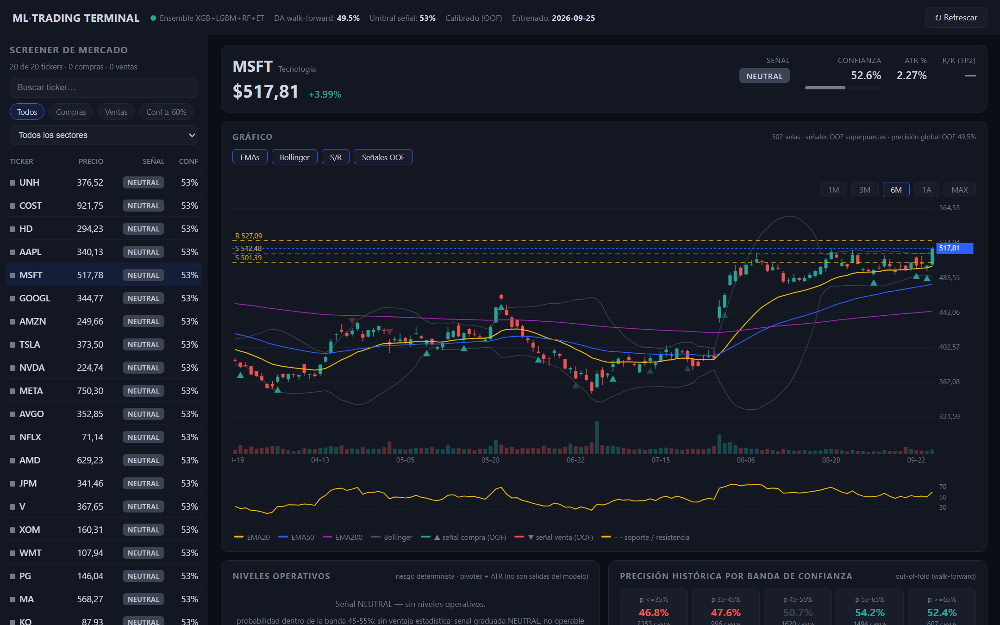

# ML_Bolsa — Predictor bursátil con validación honesta 📈


Sistema de predicción de dirección diaria con **ensemble de 4 modelos**, **50+ features estacionarias** y **validación walk-forward con purging y embargo** (sin data leakage).

> ⚠️ **Expectativas honestas.** Con validación temporal correcta, la accuracy direccional realista para acciones líquidas en horizonte diario es **53–56%**. Los números de 70–80% que prometía la versión anterior eran producto de data leakage (split aleatorio sobre una serie temporal). Este repo reporta métricas out-of-sample verificables. Proyecto con fines educativos/de investigación: **no es asesoramiento financiero**.

---

## 🔬 Metodología (qué se corrigió y por qué)

### 1. Validación walk-forward con purging y embargo

La versión anterior usaba `train_test_split(shuffle)` sobre una serie temporal: días consecutivos (casi idénticos) quedaban repartidos entre train y test, inflando la métrica. Ahora:

- Los folds avanzan **solo hacia adelante** en el tiempo.
- **Purge de 60 días** entre train y test: cubre el lookback máximo de las features (`volatilidad_60d`), eliminando el solape de ventanas rolling con el período de test.
- **Embargo de 5 días** adicional de aislamiento.

Ver `src/ml/cv.py`.

### 2. Features estacionarias

Eliminadas las features dependientes del nivel de precio (no comparables entre regímenes):

| Antes (no estacionaria) | Ahora (estacionaria) |
|---|---|
| `close_lag_1..10` (precio crudo) | `lag_ret_1..10` (retornos) |
| `macd`, `macd_diff` (escalan con el precio) | `macd_norm`, `macd_diff_norm` (÷ precio) |
| `momentum_5/10/20` (diferencia de precios) | retorno relativo |
| `obv_ema` (suma acumulada creciente) | `obv_ratio_20d` (÷ volumen 20d) |

### 3. Procesamiento por-ticker

Antes: `pd.concat()` de tickers crudos → los rolling windows y el `shift(-1)` del target cruzaban la frontera entre tickers. Ahora cada ticker se procesa (indicadores + target) **antes** de concatenar.

### 4. Contexto de mercado

Features nuevas: retornos y distancia a SMA de **SPY**, correlación rolling con el mercado, y **VIX** (nivel, z-score 60d, cambio 5d) como proxy del régimen de volatilidad.

### 5. Optuna sobre CV purgada

El tuning ahora evalúa cada trial con la misma validación walk-forward purgada (antes: `KFold` aleatorio → el tuning también filtraba).

### 6. Calibración de confianza con datos

El umbral de confianza ya no es un 75% arbitrario: se calibran las probabilidades (isotónica/Platt) sobre predicciones **out-of-fold** y se elige el umbral midiendo la **precisión real** en cada nivel. Ver `scripts/calibrate_thresholds.py`.

### 7. Backtesting con costos reales

Motor con ejecución en la **apertura del día siguiente** (anti-lookahead), comisión + spread + slippage configurables, métricas Sharpe/Sortino/MaxDD/Profit Factor/Win-Loss y desglose por régimen de volatilidad. Ver `src/backtesting/`.

---

## 📂 Estructura

```
├── src/
│   ├── data/
│   │   ├── collector.py            - descarga datos (yfinance)
│   │   ├── processor.py            - 50+ indicadores estacionarios + SPY/VIX
│   │   └── preparer.py             - datasets ML (targets por-ticker)
│   ├── ml/
│   │   ├── cv.py                   - walk-forward purgado (serie y PANEL por fechas)
│   │   ├── advanced_trainer.py     - ensemble 4 modelos + Optuna (CV purgada)
│   │   ├── advanced_predictor.py   - inferencia con calibración y umbral
│   │   ├── calibration.py          - isotónica/Platt + análisis de umbrales
│   │   ├── signal_engine.py        - señales graduadas + TP/SL/R-R (pivotes+ATR)
│   │   ├── screener.py             - escaneo batch con cache TTL y filtros
│   │   ├── trainer.py / predictor.py - sistema básico (RandomForest)
│   │   └── evaluator.py            - métricas de clasificación
│   ├── backtesting/
│   │   ├── engine.py               - motor con costos (ejecución t+1)
│   │   ├── metrics.py              - Sharpe, Sortino, MaxDD, PF, Win/Loss
│   │   └── report.py               - informe técnico markdown
│   ├── api/                        - Flask API + dashboard
│   └── utils/                      - config, logger
├── scripts/
│   ├── train_advanced.py           - entrenamiento (sin leakage)
│   ├── calibrate_thresholds.py     - umbral de confianza con datos
│   ├── backtest.py                 - backtest walk-forward + informe
│   └── ...                         - pipeline básico, API, etc.
├── tests/                          - tests pytest (CV, features, backtest, señales)
├── config.yaml
└── requirements.txt
```

## 🖥️ Terminal de trading (dashboard)

`python scripts/run_api.py` → http://localhost:5000 — terminal dark mode con:


*Screener de 20 tickers, gráfico de velas con EMAs/Bollinger, soportes/resistencias por pivotes y marcadores de señales out-of-fold (MSFT, vista 6 meses).*

- **Screener**: 20 tickers escaneados con el ensemble calibrado; filtros por lado, confianza ≥60%, sector y búsqueda.
- **Gráfico interactivo** (canvas propio, sin CDNs): velas + volumen, EMA20/50/200, Bollinger, RSI, soportes/resistencias por pivotes y **marcadores de señales OOF históricas** (opacidad = acierto).
- **Niveles operativos**: entrada, SL, TP1/TP2/TP3 (ATR + estructura técnica), R/R y sizing por riesgo fijo — marcados como ingeniería de riesgo, no salidas del modelo.
- **Precisión por banda de confianza** (heatmap OOF) y **backtesting on-demand** por ticker/período con equity curve.

API: `/api/screener`, `/api/signal/<ticker>`, `/api/chart/<ticker>`, `/api/backtest/<ticker>`, `/api/oof-summary`, `/api/meta` (+ `/api/predict/*` de compatibilidad).

## 🚀 Instalación

```bash
git clone https://github.com/FedeCtr/ML_Bolsa.git
cd ML_Bolsa
python -m venv venv
venv\Scripts\activate          # Windows
pip install -r requirements.txt
```

Compatible con **Python 3.12/3.13** (el requirements anterior no instalaba en 3.13+).

## 📊 Uso (flujo correcto, en orden)

```bash
# 1. entrenar ensemble (usa validación purgada; guarda OOF)
python scripts/train_advanced.py --optimize --trials 50

# 2. calibrar confianza y elegir umbral con datos OOF
python scripts/calibrate_thresholds.py

# 3. backtest walk-forward con costos + informe markdown
python scripts/backtest.py AAPL --period 5y

# 4. predecir (aplica calibración y umbral seleccionado)
python scripts/predict_advanced.py AAPL

# 5. API + dashboard
python scripts/run_api.py        # http://localhost:5000

# 6. tests
pytest tests/ -v
```

## 📈 Qué esperar (y qué reportar)

Resultados medidos (7 tickers tech × 5 años, panel walk-forward por fechas, purge 60d + embargo 5d):

| Métrica | Valor medido | Interpretación |
|---|---|---|
| Directional accuracy (panel) | **49.5%** | Sin edge diario bruto en universos tech |
| Precision banda ≥0.575 (OOF) | 87.5% (n=8) | El valor está en bandas de confianza alta; n muy pequeño |
| Brier (calibración isotónica) | 0.287 → 0.249 | Las probabilidades mejoran claramente calibradas |
| Backtest AAPL 3y, umbral 0.525 | −10.7%, PF 0.68 | La señal media **no** cubre costos sin filtro de confianza |

⚠️ Lección clave: el split por posiciones sobre tickers concatenados infla la métrica (fuga cross-sectional: el train contiene otros tickers en las mismas fechas). Con folds por **fecha de calendario** (train = pasado de todos los tickers, test = cross-sectional), la métrica cae a su valor honesto. Ver `build_panel_walk_forward_splits`.

Si el accuracy out-of-sample cae al corregir el leakage, **ese es el número real**. Cualquier cifra muy superior a ~56% en horizonte diario debe tratarse como sospechosa de filtración.

## 🧪 Tests

```bash
pytest tests/ -v
```

Cubren: geometría del split purgado (sin solape, purge, embargo), estacionariedad de features, motor de backtest (costos, anti-lookahead, métricas) y calibración de umbrales.

## 🗺️ Roadmap

- [x] Validación walk-forward con purging/embargo
- [x] Features estacionarias + contexto de mercado (SPY/VIX)
- [x] Calibración de probabilidades y umbral con datos
- [x] Backtesting con costos + informe técnico
- [x] Terminal dark mode: screener + gráfico + niveles + heatmap OOF + backtest interactivo
- [x] CV de panel por fechas (corrige fuga cross-sectional multi-ticker)
- [ ] Paper trading en vivo (Alpaca Paper API)
- [ ] Detección de drift/regímenes (Evidently + HMM)
- [ ] Migración Flask → FastAPI + WebSocket
- [ ] Retraining automático por degradación de métricas
- [ ] Ampliar universo (S&P 500, forex, crypto) y features exógenas

## ⚠️ Nota sobre "señales nulas"

La especificación comercial pide evitar `SIN_ACCION`. La terminal lo resuelve con **señales graduadas** (`COMPRA_FUERTE`/`COMPRA`/`NEUTRAL`/`VENTA`/`VENTA_FUERTE`): ya no hay señal nula, pero la banda media es explícitamente **NEUTRAL, no operable**. Forzar señales compraventas cuando el modelo no tiene ventaja (49.5% DA) solo fabricaría actividad; la confianza de la plataforma comercial reside en mostrar cuándo NO operar.

## 📝 Licencia

MIT. Proyecto educativo — **no constituye asesoramiento financiero**.
